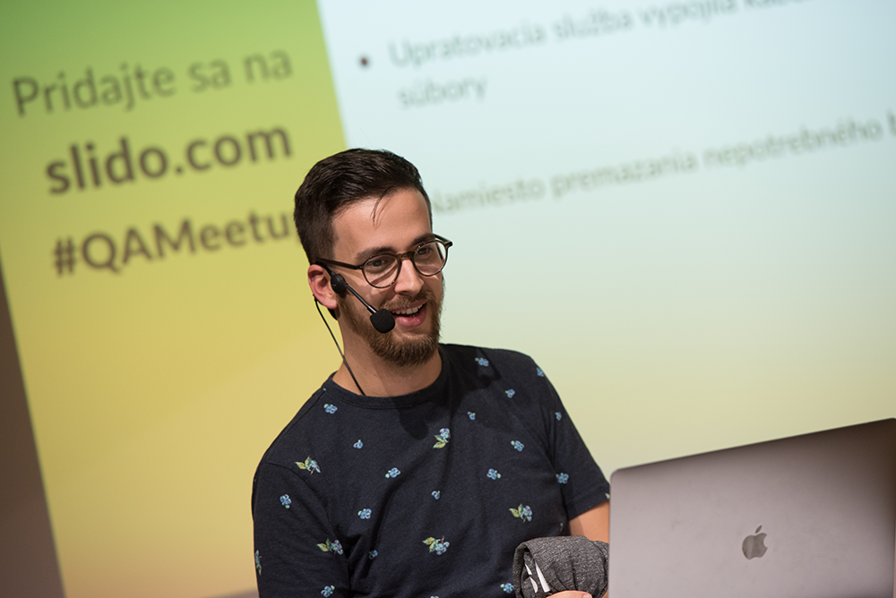

# Cypress workshop

Toto je úvodná stránka workshopu o testovaní pomocou [Cypress.io](https://www.cypress.io/). Táto stránka obsahuje všetko, čo počas workshopu slúži ako sprievodný študijný materiál. 

## Pre koho je určený workshop 🤓

Workshop som vytváral hlavne pre testerov, ktorí majú záujem začať s automatizáciou v testovaní. V tomto ohľade považujem [Cypress.io](https://www.cypress.io/) za mimoriadne efektívny nástroj. So Cypressom je jednoduché začať, zároveň je však nástrojom, ktorí používajú aj profesionáli. 

Ja sám som začal používať Cypress ešte v čase, keď som mal iba veľmi malé skúsenosti s JavaScriptom. Väčšinu toho, čo dnes ovládam, viem vďaka tomu, že som sa snažil vyriešiť nejaký problém v rámci testingu.

Nezáleží na tom, či má účastník/čka so Cypressom skúsenosti, alebo iba začína, potreby na workshope ladím podľa vedomostí účastníkov. Z vlastnej skúsenosti viem, že kombinácia skúsenejších a menej skúsených účastníkov býva skôr prospešná, než kontraporduktívna.

Workshop je rozdelený do modulov, ktoré je sa dajú kombinovať a prispôsobovať podľa potrieb a záujmu účastníkov.

## Ako workshop vediem

Pred workshopom prosím účastníkov, aby si [prešli prípravou](uvod/start/). Ide hlavne o inštalácie a kontrolu potrebných prerekvizít. To nám zaistí rovnakú štatovaciu čiaru.

Workshop je rozdelený do menších modulov. Väčšina modulov kopíruje nasledovnú štruktúru:

1. Teória
2. Ukážka
3. Praktické cvičenie, úloha
4. Vyhodnotenie riešenia
5. Spätná väzba, Q&A

Na spätnú väzbu počas workshopu používam [Slido](https://www.sli.do/), pomocou ktorého ktoré kladiem otázky, pýtam si spätnú väzbu, prípadne zbieram otázky účastníkov, na ktoré odpovedám. Z mojej skúsenosti je najmä v začiatkoch workshopu ťažké „zdvihnúť ruku“ a opýtať sa nejakú otázku. Slido mi umožňuje efektívne si mapovať či účastníci rozumejú tomu, čo hovorím, alebo sa v inštrukciách strácajú.

Viem, že neviem všetko a nesnažím sa mať na všetko odpoveď, alebo názor. Moja skúsenosť je, že na workshopoch sa obvykle sám veľa naučím. Niekedy hľadáme odpovede s účastníkmi spoločne. Veď na to máme Google a stackoverflow 🙂

S účastníkmi workshopu si tykáme.

## Krátko o mne

Vyštudoval som psychológiu. Verím, že mi to pomáha vo svete technológii udržiavať fokus na človeka.

Zároveň som však beznádejný technofil, čo zrejme spôsobilo to, že po pár rokoch psychologického poradenstva som nakoniec zakotvil v technickom odvetví. Na pohľad je to dlhý skok, no odkedy robím testera, cítim, že mám srdce na pravom mieste. Slovami klasika: _„Ja si to užívam, ja sa cítim dobre.“_

Momentálne pracujem ako QA lead v spoločnosti Slido. Vediem náš 6-členný QA tím a starám sa o automatizáciu. Dennodenne tvorím automatické testy v Cypresse, ktorých je už takmer 1000, a ktoré pomáhajú zaistiť releasovanie v Slido. To je aktuálne na úrovni cca 40 releasov mesačne 😅

Sledovať a kontaktovať ma možno

* [Linkedin](https://www.linkedin.com/in/filip-hric-11a5b1126/)
* [Twitter](https://twitter.com/filip_hric)
* [filip@filiphric.sk](mailto:filip@filiphric.sk)
* ale hlavne [na mojom blogu na mediume](https://medium.com/@filiphric)

