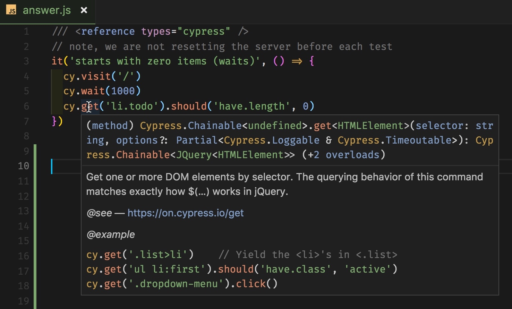

# Intelligent code completion

Intelligent code completion uľahčuje a zrýchľuje písanie kódu. Skús si upraviť `test.js` podľa nasledovného príkladu:

```javascript
/// <reference types="cypress" />
it('loads', () => {
  cy.visit('localhost:3000')
})
```

Autocomplete + dokumentácia priamo v kóde:



Ak chceš ísť o krok ďalej, uprav kód nasledovne:

```javascript
/// <reference types="cypress" />
// @ts-check
it('loads', () => {
  cy.visit('localhost:3000')
})
```

Intelligent code completion teraz opravuje preklepy. Vyskúšaj si to! Skús namiesto `cy.visit` napísať `cy.vist`

