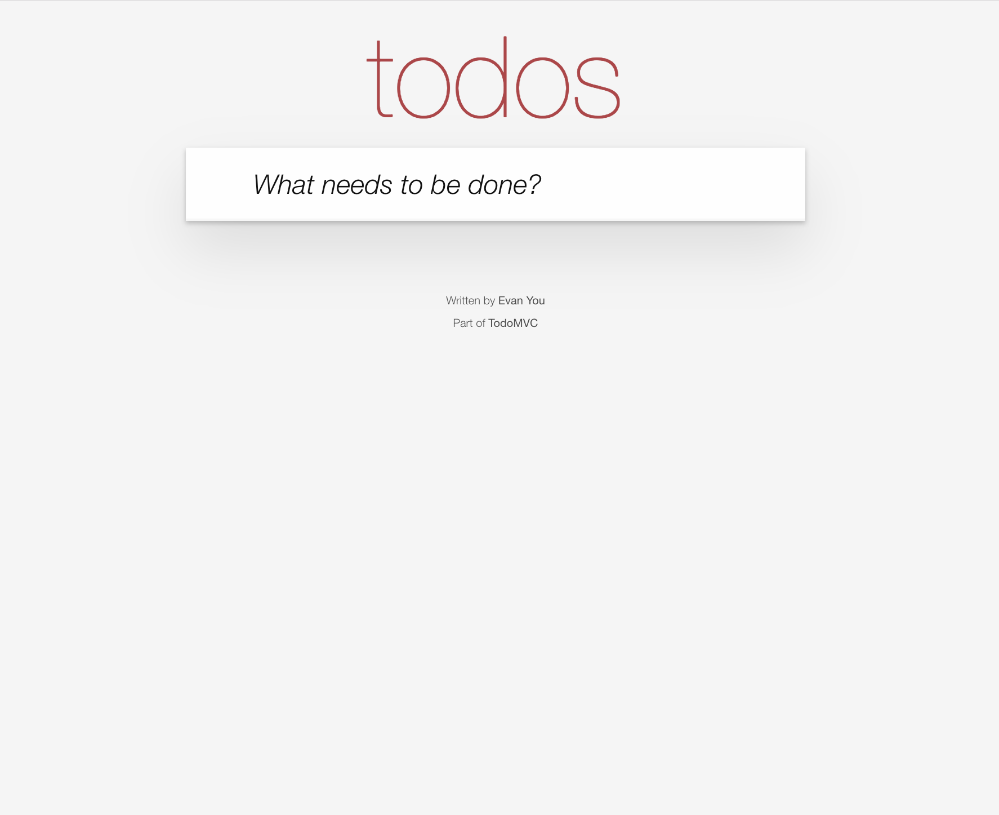

# Príprava na workshop

## Technické požiadavky: ⚙️

* Akýkoľvek počítač: Mac, Windows, Linux
* Node verzia 8 alebo vyššia
* git
* Textový editor - odporúčam [VS Code](https://code.visualstudio.com/download), v ktorom budem počas workshopu pracovať aj ja 


#### Node? Git? WTF? 😕

Ak si nie si istý/á verziou Node a Git, [pomôžem Ti na tejto stránke](skontroluj-si-verziu-node-a-git.md)


## Príprava:

Naklonuj si repozitár a nainštaluj čo treba. Postačia na to tri kroky

```bash
git clone https://github.com/filiphric/cypress-workshop.git
cd cypress-workshop
npm install
```


Ak by niektorý z krokov skončil chybou, [skontroluj si prosím verziu Node a Git](skontroluj-si-verziu-node-a-git.md).

Pokiaľ Ti nejde naklonovať repozitár, môžeš si ho stiahnúť ako .zip súbor [priamo na stránke GitHubu](https://github.com/filiphric/cypress-workshop).


## Čo je v repozitári?

V repozitári sa nachádza všetko, čo budeme počas workshopu potrebovať.

* aplikácie, ktoré budeme spoločne testovať:
  * TodoMVC
  * Realworld
* Cypress
* všetky potrebné moduly a skripty

## Skúška správnosti

Vyskúšaj si, či nám fungujú aplikácie, ktoré budeme testovať. Tieto aplikácie budeme používať počas nášho workshopu. Nepôjdeme teda na živý server, alebo web niekde na internete, ale pobeží nám všetko lokálne. 


Nemusíš sa príliš obávať o to, ako sú jednotlivé aplikácie naprogramované. Spoločne sa s aplikáciami zoznámime a pozrieme sa na to, ako fungujú. Hlavne sa však zameriame na ich testovanie a na zamýšľanie sa nad tým, ako by k nim pristupoval bežný používateľ.


### Aplikácia TodoMVC

Skús si najprv zapnúť aplikáciu TodoMVC:

```bash
npm run start:todomvc
```

Po zadaní príkazu by si mal/a vidieť:

```text
> json-server --static . data.json --middlewares ./node_modules/json-server-reset


  \{^_^}/ hi!

  Loading data.json
  Loading ./node_modules/json-server-reset
  Done

  Resources
  http://localhost:3000/todos

  Home
  http://localhost:3000
```


Ak Ti príkaz vyhodí chybu, uisti sa, že sa nachádzaš v správnom foldri a že si prešiel/la všetkými krokmi inštalácie.


Otvor si browser a zadaj adresu `http://localhost:3000`. Aplikácia by mala byť live:



### Aplikácia Realworld


## Aplikácia 💾

[Vue.js](https://vuejs.org/) + [Vuex](https://vuex.vuejs.org/) + REST server aplikácia, ktorú budeme testovať je vo foldri `todomvc`. Aplikácia je popísaná [v tomto blogu](https://www.cypress.io/blog/2017/11/28/testing-vue-web-application-with-vuex-data-store-and-rest-backend/). Aplikácia beží aj bez pripojenia na internet

## Prezentácia  🖥

Prezentáciu je možné si pozrieť na [https://gitpitch.com/filiphric/cypress-workshop](https://gitpitch.com/filiphric/cypress-workshop) začína súborom [PITCHME.md](https://github.com/filiphric/cypress-workshop/tree/e1fcbaed1c3d927bb9f2d0908f2bfc831887fa18/PITCHME.md), prezentovaná pomocou [GitPitch](https://gitpitch.com/). `PITCHME.md` obsahuje súbory z foldra [slides](https://github.com/filiphric/cypress-workshop/tree/e1fcbaed1c3d927bb9f2d0908f2bfc831887fa18/slides/README.md). Účastnícikom workshopu sa odporúča otvoriť si [prezentáciu](https://gitpitch.com/filiphric/cypress-workshop) a sledovať priebeh. Jednotlivé časti prezentácie je možné otvárať aj separátne kliknutím na tabuľku nižšie.

## Obsah 🗂

|  | topic | folder | contents | slides |
| :--- | :--- | :--- | :--- | :--- |
| [🔗](../../) | Intro, TodoMVC application | [todomvc](https://github.com/filiphric/cypress-workshop/tree/e1fcbaed1c3d927bb9f2d0908f2bfc831887fa18/todomvc/README.md) | [intro.md](https://github.com/filiphric/cypress-workshop/tree/e1fcbaed1c3d927bb9f2d0908f2bfc831887fa18/slides/intro/PITCHME.md) | [link](https://gitpitch.com/filiphric/cypress-workshop?p=slides/intro) |
| [🔗](../../) | Vytvorenie projektu v Cypress | [00-start](https://github.com/filiphric/cypress-workshop/tree/e1fcbaed1c3d927bb9f2d0908f2bfc831887fa18/00-start/README.md) | [00-start](https://github.com/filiphric/cypress-workshop/tree/e1fcbaed1c3d927bb9f2d0908f2bfc831887fa18/slides/00-start/PITCHME.md) | [link](https://gitpitch.com/filiphric/cypress-workshop?p=slides/00-start) |
| [🔗](../../) | Základné príkazy | [01-basic](https://github.com/filiphric/cypress-workshop/tree/e1fcbaed1c3d927bb9f2d0908f2bfc831887fa18/cypress/integration/01-basic/README.md) | [01-basic](https://github.com/filiphric/cypress-workshop/tree/e1fcbaed1c3d927bb9f2d0908f2bfc831887fa18/slides/01-basic/PITCHME.md) | [link](https://gitpitch.com/filiphric/cypress-workshop?p=slides/01-basic) |
| [🔗](../../) | Pridávanie položiek v TodoMVC | [02-adding-items](https://github.com/filiphric/cypress-workshop/tree/e1fcbaed1c3d927bb9f2d0908f2bfc831887fa18/cypress/integration/02-adding-items/README.md) | [02-adding-items](https://github.com/filiphric/cypress-workshop/tree/e1fcbaed1c3d927bb9f2d0908f2bfc831887fa18/slides/02-adding-items/PITCHME.md) | [link](https://gitpitch.com/filiphric/cypress-workshop?p=slides/02-adding-items) |
| [🔗](../../) | Hráme sa so selectormi | [03-selector-playground](https://github.com/filiphric/cypress-workshop/tree/e1fcbaed1c3d927bb9f2d0908f2bfc831887fa18/cypress/integration/03-selector-playground/README.md) | [03-selector-playground](https://github.com/filiphric/cypress-workshop/tree/e1fcbaed1c3d927bb9f2d0908f2bfc831887fa18/slides/03-selector-playground/PITCHME.md) | [link](https://gitpitch.com/filiphric/cypress-workshop?p=slides/03-selector-playground) |
| [🔗](../../) | Resetovanie stavu | [04-reset-state](https://github.com/filiphric/cypress-workshop/tree/e1fcbaed1c3d927bb9f2d0908f2bfc831887fa18/cypress/integration/04-reset-state/README.md) | [04-reset-state](https://github.com/filiphric/cypress-workshop/tree/e1fcbaed1c3d927bb9f2d0908f2bfc831887fa18/slides/04-reset-state/PITCHME.md) | [link](https://gitpitch.com/filiphric/cypress-workshop?p=slides/04-reset-state) |
| [🔗](../../) | Pracujeme s networkom | [05-xhr](https://github.com/filiphric/cypress-workshop/tree/e1fcbaed1c3d927bb9f2d0908f2bfc831887fa18/cypress/integration/05-xhr/README.md) | [05-xhr](https://github.com/filiphric/cypress-workshop/tree/e1fcbaed1c3d927bb9f2d0908f2bfc831887fa18/slides/05-xhr/PITCHME.md) | [link](https://gitpitch.com/filiphric/cypress-workshop?p=slides/05-xhr) |
| [🔗](../../) | Konfigurácia | - | [06-configuration](https://github.com/filiphric/cypress-workshop/tree/e1fcbaed1c3d927bb9f2d0908f2bfc831887fa18/slides/06-configuration/PITCHME.md) | [link](https://gitpitch.com/filiphric/cypress-workshop?p=slides/06-configuration) |
| [🔗](../../) | Custom commandy | [07-custom-commands](https://github.com/filiphric/cypress-workshop/tree/e1fcbaed1c3d927bb9f2d0908f2bfc831887fa18/cypress/integration/07-custom-commands/README.md) | [07-custom-commands](https://github.com/filiphric/cypress-workshop/tree/e1fcbaed1c3d927bb9f2d0908f2bfc831887fa18/slides/07-custom-commands/PITCHME.md) | [link](https://gitpitch.com/filiphric/cypress-workshop?p=slides/07-custom-commands) |
| [🔗](../../) | Záver workshopu | - | [end](https://github.com/filiphric/cypress-workshop/tree/e1fcbaed1c3d927bb9f2d0908f2bfc831887fa18/slides/end/PITCHME.md) | [link](https://gitpitch.com/filiphric/cypress-workshop?p=slides/end) |

## Thanks

Thanks to Gleb Bahmutov, author of the original workshop found at [https://github.com/cypress-io/testing-workshop-cypress](https://github.com/cypress-io/testing-workshop-cypress), on which this workshop is heavily built on.

