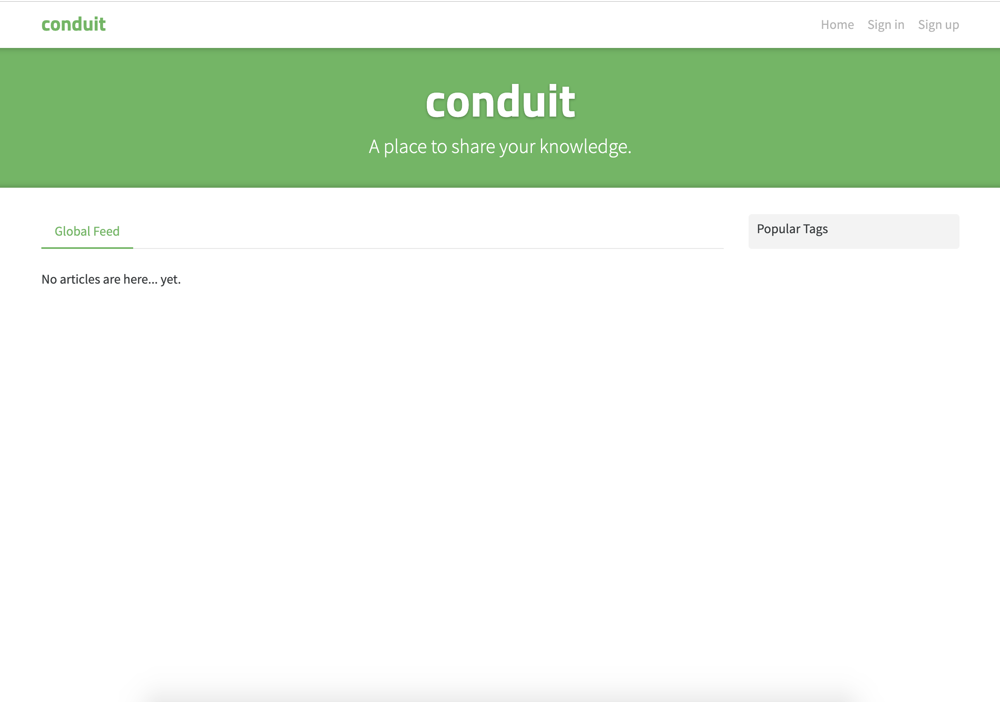

# Príprava na workshop

## Technické požiadavky:

* Akýkoľvek počítač: Mac, Windows, Linux
* Node verzia 8 alebo vyššia
* git
* Textový editor - odporúčam [VS Code](https://code.visualstudio.com/download), v ktorom budem počas workshopu pracovať aj ja 


#### Node? Git? WTF? 😕

Ak si nie si istý/á verziou Node a Git, [pomôžem Ti na tejto stránke](skontroluj-si-verziu-node-a-git.md)

Pokiaľ Ti Git nič nehovorí, odporúčam si pred začiatkom workshopu aspoň zbežne naštudovať o čo ide. Nie je potrebné, aby si ovládal/a všetky príkazy, stačí mať základné pochopenie toho, na čo Git slúži. Odporúčam napríklad tento článok na [freecodecamp](https://www.freecodecamp.org/news/best-git-tutorial/).

Takisto odporúčam prečítať si aj tento [krátky tutoriál o tom, čo je Node.js](https://www.freecodecamp.org/news/cjn-understanding-hello-world-in-nodejs/). Pomôže Ti to lepšie pochopiť kontext.

Určite nezaškodí naštudovať si ani [základné príkazy v command line](https://www.freecodecamp.org/news/conquering-the-command-line-f85f5e46c07c/).

Ak sa Ti z týchto vecí točí hlava, netráp sa. Všetko potrebné si počas workshopu dovysvetlíme.


## Príprava:

Naklonuj si repozitár a nainštaluj čo treba. Postačia na to tri kroky

```bash
git clone https://github.com/filiphric/cypress-workshop.git
cd cypress-workshop
npm install
```


Ak by niektorý z krokov skončil chybou, [skontroluj si prosím verziu Node a Git](skontroluj-si-verziu-node-a-git.md).

Pokiaľ Ti nejde naklonovať repozitár, môžeš si ho stiahnúť ako .zip súbor [priamo na stránke GitHubu](https://github.com/filiphric/cypress-workshop).


## Čo je v repozitári?

V repozitári sa nachádza všetko, čo budeme počas workshopu potrebovať.

* aplikácie, ktoré budeme spoločne testovať:
  * TodoMVC
  * Realworld
* Cypress
* všetky potrebné moduly a skripty

## Skúška správnosti

Vyskúšaj si, či nám fungujú aplikácie, ktoré budeme testovať. Tieto aplikácie budeme používať počas nášho workshopu. Nepôjdeme teda na živý server, alebo web niekde na internete, ale pobeží nám všetko lokálne. 


Nemusíš sa príliš obávať o to, ako sú jednotlivé aplikácie naprogramované. Spoločne sa s aplikáciami zoznámime a pozrieme sa na to, ako fungujú. Hlavne sa však zameriame na ich testovanie a na zamýšľanie sa nad tým, ako by k nim pristupoval bežný používateľ.


### Aplikácia TodoMVC

Skús si najprv zapnúť aplikáciu TodoMVC:

```bash
npm run start:todomvc
```

Po zadaní príkazu by si mal/a vidieť:

```text
> json-server --static . data.json --middlewares ./node_modules/json-server-reset


  \{^_^}/ hi!

  Loading data.json
  Loading ./node_modules/json-server-reset
  Done

  Resources
  http://localhost:3004/todos

  Home
  http://localhost:3004
```


Ak Ti príkaz vyhodí chybu, uisti sa, že sa nachádzaš v správnom foldri a že si prešiel/la všetkými krokmi inštalácie.


Po zadaní príkazu by sa Ti mal otvoriť browser na lokalite `http://localhost:3004` a zobraziť by sa Ti mala nasledovná stránka:


### Aplikácia Realworld

Aplikáciu Realworld spustíš nasledovným príkazom:

```text
npm run start:realworld
```

Tento príkaz spustí webovú aplikáciu a server. Server beží na lokalite `localhost:3000` a webová aplikácia na `localhost:4100` Po otvorení tejto lokality by si v browseri mal vidieť nasledovnú stránku:




