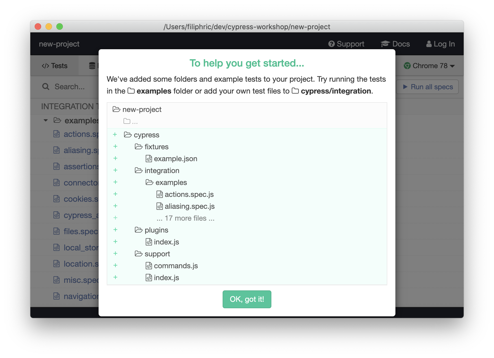

# Cypress projekt a jeho štruktúra

## Vytvorenie nového projektu

Pre vytvorenie nového Cypress projektu zadaj nasledovný príkaz:

```text
npx cypress open --project ./new-project
```

Po otvorení sa Ti otvorí GUI:



V textovom editore môžeš vidieť, že Cypress vytvoril nový folder `new-project`, v ktorom sa nachádzajú ďalšie súbory.


### Na čo slúžia jednotlivé súbory

|  Názov | Popis |
| :--- | :--- |
| cypress.json | Cypress settings |
| cypress/integration | test súbory |
| cypress/fixtures | mock dáta |
| cypress/plugins | Cypress pluginy |
| cypress/support | commandy, utility, defaultné akcie |


