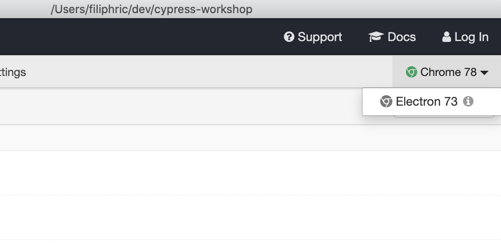

# Píšeme prvý test

1. Otvor textový editor a vytvor nový súbor vo foldri:

```text
cypress/integration/test.js
```

1. Do súboru vpíš tento kód:

```javascript
it('loads', () => {
  cy.visit('localhost:3000')
})
```

1. Uisti sa, že TodoMVC aplikácia beží. ak nie, otvor si nový terminál a napíš `npm start`  
2. Klikni na "test.js" v Cypress GUI

## Prepínanie browsera



