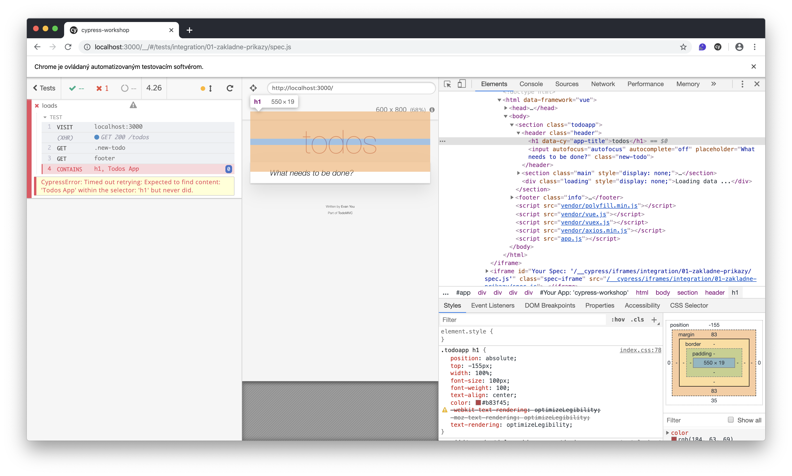

# Riešenie úloh a otázok

### Otázky:

* Kde nájdeš dokumentáciu pre cy.contains command?

> [https://on.cypress.io/contains](https://on.cypress.io/contains)

* Ako funguje cy.contains command?

> [https://docs.cypress.io/api/commands/contains.html\#Syntax](https://docs.cypress.io/api/commands/contains.html#Syntax)

* Prečo command padol?

> Nesprávny text v argumentoch commandu

* Ako by si na to využil/a DevTools?



### Pokročilá úloha:

* uprav test tak, aby padol, ale až po 10 sekundách

```javascript
it('loads', () => {

  cy
    .visit('localhost:3000')

  cy
    .get('.new-todo')
    .get('footer')

  cy
    .contains('h1', 'Todos App', {timeout: 10000})

})
```


